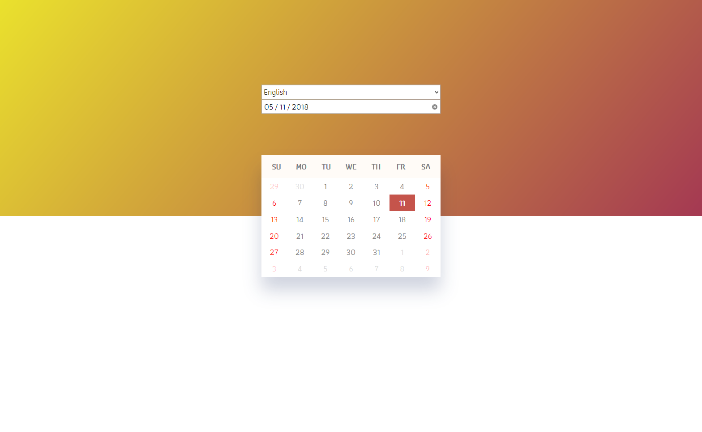

# ReactJS calendar - test

## Introduction
This was an entry test for a job interview:

### HTML Calendar  

The task:

The program reads a date or uses the current date by default and renders a month as an 
output. The month should be in a calendar format:
-   First row is the name of the days (Mon, Tue, …)
-   Weeks of the month should be in separate rows where the days listed as numbers
-   The current day should be marked in bold
-   The weekend should be marked in different color than the workdays

Additional info:

You should use JavaScript.
You should use standard Date object or a library that is created in JavaScript.
You should write production code that you would push to a repository and solves the feature.
You should submit the solution even if it is not fully finished.

## Screenshot of this solution
<!--  -->

